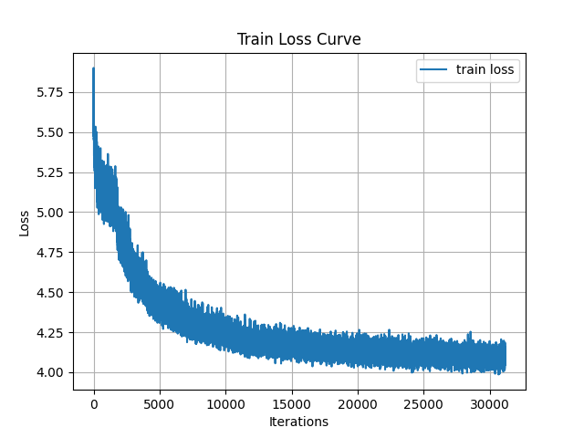
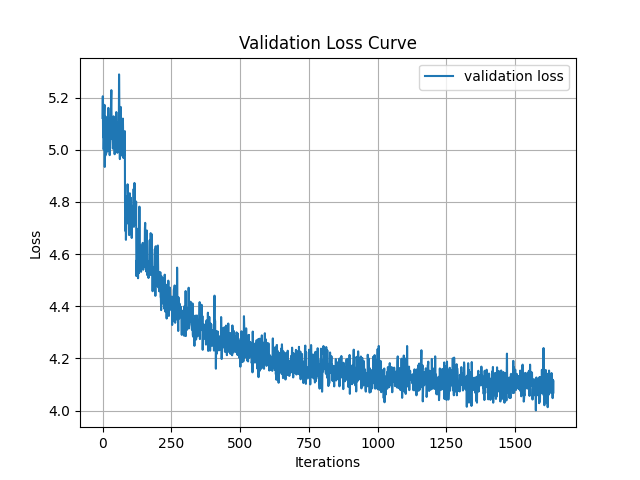

# SimCLR
PyTorch Implementation of the paper 'A Simple Framework for Contrastive Learning of Visual Representations' (ICML 2020)

* **Requirements**
  * numpy
  * torch
  * torchvision
  * opencv-python
  
* **command**
  - python3 main.py --epochs [epochs] --batch_size [B] --temperature [T] --out_dim [out_dim] --num_worker [N] --valid_size [val_size]

### Details
* **Encoder** : ResNet18 based, trained on STL-10 Dataset training/unlabeled data
* **Projection Head** : 1 hidden layer (2048 units) MLP with ReLU activation
* **Classifier** : 1 hidden layer (1024 units) MLP with ReLU activation
* Training 100 epochs with early stopping on validation loss (patience = 5)
* Batch size 512, Temperature for NT-Xent Loss 0.5

### Results
|                    Accuracy                    |                   STL-10                  | CIFAR-10 | CIFAR-100 |
|:----------------------------------------------:|:-----------------------------------------:|:--------:|:---------:|
|            Baseline (Supervised)            |                   0.4875                  |  0.9302  |   0.7561  |
| Linear Evaluation Protocol (No fine tuning) | 0.6612 / 0.7365 (batch size 128 / 512) |  0.5273  |   0.2428  |
|                   Fine tuning                  | 0.7416 / 0.7805 (batch size 128 / 512) |  0.7063  |   0.3757  |

### Loss Curves

  
  

### References
[1] Chen, Ting, et al. "A simple framework for contrastive learning of visual representations." arXiv preprint arXiv:2002.05709 (ICML 2020).

[2] STL-10 Dataset. (https://cs.stanford.edu/~acoates/stl10/)

[3] Template code from JoonHyung Park, SimCLR, 2020. (https://github.com/JoonHyung-Park/SimCLR)
